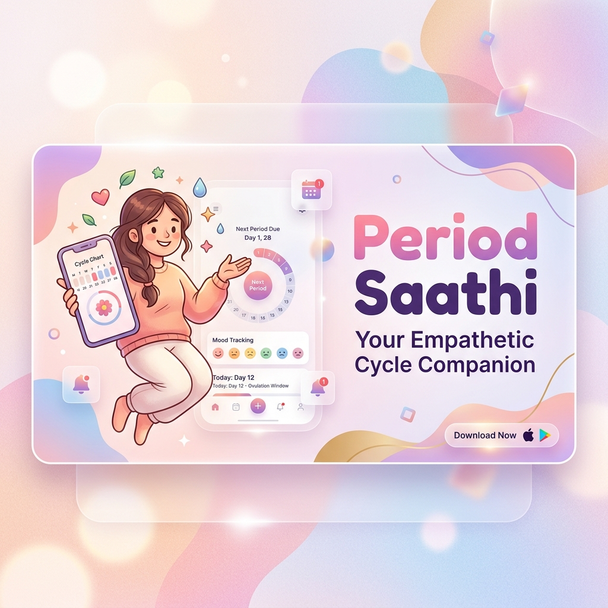

# Period Saathi 🌸 — Menstrual Wellness & Couples Companion

Your empathetic, beautifully animated Android period companion and self-care recovery hub — built with Kotlin, Jetpack Compose, and Clean Architecture.

> **saathi** (साथी) — *companion, friend* (Hindi)



Period Saathi goes beyond basic calendars. It is designed to be an emotionally supportive, premium sanctuary offering offline self-care plans, programmatic frequency synthesizers, guided workouts, secure couples sync, anonymous chats, and a custom gamified companion mascot.

---

## ✨ Features Breakdown

### 📊 1. Core Cycle Tracking & Predictions
* **Cycle Logging**: A color-coded calendar matrix capturing flow metrics, cramps severity, energy levels, and moods.
* **Intelligent Offline Predictions**: High-fidelity cycle phase detection mapping logs to Menstrual, Follicular, Ovulatory, and Luteal phases dynamically.

### 🧘 2. Premium Wellness Hub (Bento Care Grid)
* **Liquid Score Canvas**: A custom-drawn test-beaker representing daily health using sine-wave fluid canvas physics.
* **Mascot Reactivity**: A responsive, custom-animated mascot companion that displays comforting faces based on the logged wellness score.
* **Personalized Care sheet**: Select symptoms to instantly customize diet tips, herbal recipes, and exercise schedules.
* **Zen Breathing companion**: An expanding gradient breathing orb aligned with rhythmic haptic ticks and synthetic audio tones.
* **Frequency Sound Synth**: Generates Theta binaural relaxation frequencies (`6Hz` offset) programmatically on-the-fly, operating entirely offline.
* **ExoPlayer Yoga Coach**: Local MP4 video guide demonstrating postures, paired with voice text-to-speech cues.

### 👭 3. Secret Chats (Anonymous Safe Board)
* **Capsule Search Header**: Search bar, bookmark, and notification badge items styled with Period Saathi pastel palettes.
* **Offline Gallery Image Picker**: Dynamic local picture uploading (`content://` or `file://` URI decoders) displaying visual preview cards inside the compose panel.
* **Upvote & Comments**: Safe, completely anonymous post feeds and thread interactions.

### 💑 4. Premium Partner Mode (Flo for Partners Redefined)
* **Secure Invite Handshake**: Heart canvas physics particles drifting upwards inside a holographic 6-digit code box.
* **Couples Dashboard**: Synchronized, read-only phase cards, mini Prediction calendars, and typewriter tips.
* **Bud-to-Bloom Canvas Flower**: A gorgeous vector flower that grows in size and color as the primary's ovulation day nears.
* **Hormone Trend Curves**: Sliding dual-curve Bezier charts plotting Progesterone (Lavender) and Estrogen (Blush Pink) cycles.
* **Compatibility Quizzes**: Spring-loaded flip slides revealing mutual understanding scores and Communication King 👑 crowns.

### 🔒 5. Extreme Security & Local Caching
* **100% Offline Datastores**: Main logs are stored locally in Room databases; sensitive journals are never written to shared cloud profiles.
* **Separate Partner SQLite DB**: Isolates partner connection registries into `partner_db` to protect primary user boundaries and prevent migration risks.
* **Biometric Lock Integration**: Secure authentication safeguards to lock cycle history.

### 💳 6. Stripe Payment SDK Integration (Secure Premium Monetization)
* **Secure Checkout Flow**: A robust, production-ready implementation using Stripe Payment Intents securely synchronized with a Supabase Edge Function to avoid key exposure.
* **Holographic Sandbox Card**: A custom-drawn glassmorphic interactive credit card visualizer to test sandbox purchases instantly in offline or developer test environments.
* **Confetti Celebration Overlay**: Full premium animation transitions and spring-loaded victory cards that lock or unlock premium tiers dynamically.

---

## 🛠️ Tech Stack & Architecture

```
ui/        ➔ Jetpack Compose, ViewModels (MVVM)
domain/    ➔ UseCases, Custom Prediction / Health Inference Engines
data/      ➔ Local Room Database (Cycle, Partner, Forums) & Firestore Sync, Stripe Service
di/        ➔ Dagger Hilt Providers
```

| Layer | Technology |
|:---|:---|
| **Language** | Kotlin 2.2.10 |
| **UI Framework** | Jetpack Compose (BOM 2026.02.01) |
| **Haptic Triggers** | springClickable physics modifiers & LocalHapticFeedback |
| **Background Sync** | WorkManager (hydration alarms and Water reminder notifications) |
| **Data Layers** | Room DB, DataStore, Firestore Syncer, JSON raw asset loaders |
| **Monetization** | Stripe Android SDK (v20.40.0) with PaymentSheet presentWithPaymentIntent integration |
| **Audio / Video** | AudioTrack Binaural Wave Synthesizer & ExoPlayer media containers |

---

## 🚀 Build & Installation Guide

### Compilation
Verify build integrity using the Kotlin compiler task:
```bash
./gradlew compileDebugKotlin
```

### Building the APK
To assemble the debug package, run:
```bash
./gradlew :app:assembleDebug
```
The compiled package will be saved under:
`app/build/outputs/apk/debug/app-debug.apk`

---

## ⚠️ Notes on `installDebug` Gradle Command

If you attempt to run `.\gradlew installDebug` and encounter the following error:
> *Task 'installDebug' not found in root project 'PeriodSaathi'...*

This occurs because **no Android emulator or physical device is actively connected** (and `adb` is not in your system PATH). The Android Gradle Plugin (`9.2.1`) registers the installation tasks dynamically only when it detects a running target.

**To resolve**:
1. Open your Android Emulator or connect a physical phone via USB.
2. Enable **USB Debugging** on the device.
3. Run `.\gradlew :app:installDebug` again to successfully flash the app.
